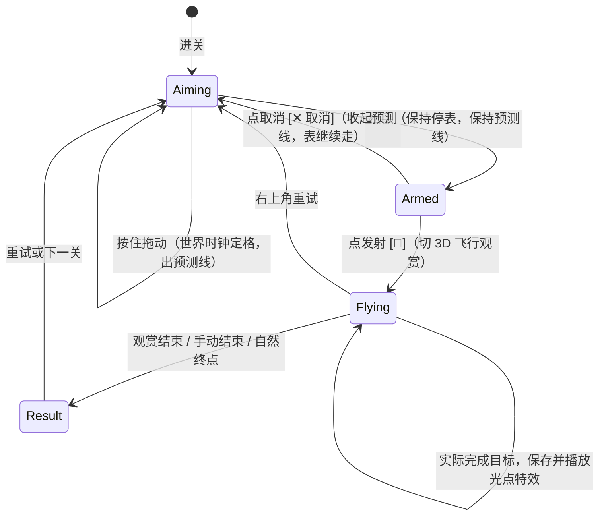

# 《单程》数据驱动街机引力弹弓 · 游戏设计案（最终定稿）

> 制定日期：2026-09-28 | 最新修订：2026-09-29
> 适用版本：Dora SSR + TypeScript 游戏工程
> 核心定位：类似《愤怒的小鸟：太空版》的同屏街机引力弹弓，关卡由 JSON 数据驱动。
> 事实来源：本文定义目标体验；开发手册定义工程实现；两份关卡 JSON 记录当前运行数据。标为「待实施」的方案尚未写入运行数据。

---

## 一、 核心玩法与设计愿景

### 1. 设计宗旨
- **彻底抛弃历史硬核包袱**：推翻原本繁琐复杂的真实天文 AU 尺度、8000 步慢推演、冗长时间轴与容易崩溃的轨道偏心率计算；
- **规划与观赏分工**：2D 规划展示轨道关系，3D 通过局部特写与总览展示实际飞行。规划为瞬时点火近似，实际积分有限燃烧，结算只依据实际轨迹；
- **引力弹弓的核心乐趣**：观察安全掠过天体时的轨迹转弯与相对中心天体的轨道能量变化，不依赖陨石、三星收集或大型星门；
- **天体时钟与时机捕捉（Timing）**：系统呈现活生生运转的机械宇宙钟表感，抓住公转窗口一击必杀！

### 2. L1 低轨减速掠月与返回观赏（2026-09-29 优先口径）

本节为已实现的 L1 口径。L2/L3 与三关共用的成功光点见下一节，逻辑、桌面输入与太阳主光视觉回归均通过；下文旧 JSON 示例为实施前快照。

- L1 只有地球、月球、飞船和目标光点；月球具有引力和实体碰撞，不放陨石、收集星尘或三星评价。
- 飞船在地心半径 132（表面高度 90，约月球距地球的 1/4）的圆轨道待命，默认待机 0.25×；拖动、松手后的 Armed 与入场运镜冻结日期和飞船。拖动只调整远地点半径 132–520，方向由顺行切线确定，按发射才点火。
- 规划用瞬时速度增量；实际轨迹积分恒定推力 50。基准力度 0.875、远地点 471.5、Δv 15.0768、燃烧 0.3015 秒。点火与近月点前后各 2 游戏秒为 1×，其余 3×，基准观看 13.8 秒，目标为 12–18 秒。没有第二次制动或绕月入轨要求。
- 月球轨道半径 390、初始相位 341.0207158°、GM 6000。基准发射日期为 1 游戏秒，待机约 4 真实秒进入首个窗口。引导光点在月球旁径向/切向偏移 (52.2,6.5)，范围半径 15，与月球半径 28 分离。光点无质量或碰撞，仅引导，不参与通关判定；两个视图共用 `goalPositionAt`。
- 首次进入月球距离 110、近月点位于 42–85、安全离开 110，并且出入处地心比能降低至少 25，才判完成。分析只读取实际有限燃烧轨迹；规划也能给出减速掠月预览，允许小幅偏差。
- 安全掠月后提示「掠月完成」并立即保存通关，继续 Flying。首次向内返回地心半径 180、玩家点「结束观赏」、自然撞毁/逃逸、或完成后 12 游戏秒才打开结果。返回不是通关条件，完成后不撤销记录。
- 自动分镜为点火特写、探测器巡航、月球与探测器掠过、约 1 秒总览、地球与探测器返回。发射直接切特写，其余转换约 0.6 真实秒。掠月机位的方位在进入会遇时锁定。可循环「自动 → 探测器 → 月球 → 地球 → 总览 → 自动」，手动选择保持，重试回自动；保留 2D/3D。
- `transfer` 增加可选 `flyby`（会遇/安全/能量阈值、待机/慢放/总览/超时参数）。没有它的关卡保持原行为。L1 展示完成状态，沿用已有通关记录和存档格式。

数值求解与验收：`node tools/transfer-check.mjs`、`pwsh tools/flyby-play.ps1`（完整返回）、`pwsh tools/flyby-play.ps1 -ManualEnd`（手动结束），证据见 `.agent/plan/PROGRESS.md`。

### 3. L2/L3 日心关卡修订（已实现，桌面输入通过）

L2 为「日心外圈圆轨 → 金星减速 → 内圈目标区域」，L3 为「日心内圈圆轨 → 木星加速 → 土星加速 → 外圈目标区域」。两关只保留太阳、借力行星、探测器及目标光点，移除陨石、星尘和三星；目标光点没有质量或碰撞，只引导，不要求精确追上。

太阳静止于原点，GM 800000、实体半径 50。L2 逆行点火，拖动降低近日点；L3 顺行点火，拖动提高远日点。系统确定切向方向，只有出发时短时喷火，没有飞行后半段自动反推。

| 参数 | L2 | L3 |
|---|---|---|
| 探测器待命圆轨 | 半径 400，相位 90° | 半径 280，相位 200° |
| 借力天体 | 金星：GM 12000、半径 40、轨道 220、相位 312° | 木星：GM 90000、半径 46、轨道 350、相位 244°；土星：GM 35000、半径 42、轨道 650、相位 316° |
| 拖动映射 | 近日点由 400 降至 120 | 远日点由 280 升至 560 |
| 基准规划 | 近日点 180，力度 11/14（约 0.786） | 远日点 420，力度 0.5 |
| 恒定推力加速度 | 32 | 17 |
| 基准 Δv / 燃烧时长 | 9.4881 / 0.2965 秒 | 5.1018 / 0.3001 秒 |
| 目标轨道区域 | 日心半径 150–170，首次向内进入 | 日心半径 900–960，首次向外进入 |
| 引导光点圆轨 | 半径 160，相位 39.44137827425129° | 半径 930，相位 341.7162941770894° |

所有圆轨逆时针，周期由太阳 GM 计算。基准发射日期为游戏时间 1 秒；待机 0.25×，拖动、Armed 与入场运镜冻结。预测和实际飞行均用固定步长 0.016 秒、上限 3600 步。点火与每次近掠前后各 2 游戏秒按 1×，其余 3×。

减速/加速比较日心比能 `ε = |v|²/2 − GM太阳/r`，并以对应行星引力的做功核实来源；向太阳下落本身会变快，不能拿瞬时速度升降替代借力判定。

| 遭遇 | 进入/离开距离 | 安全近掠距离 | 完整遭遇的条件 |
|---|---:|---:|---|
| 金星 | 110 | 52–90 | 日心比能下降至少 75，金星负做功绝对值至少 75 |
| 木星 | 120 | 60–100 | 日心比能增加至少 75，木星做功至少 75 |
| 土星 | 120 | 55–95 | 日心比能增加至少 75，土星做功至少 75 |

- 每颗天体认首次完整的进入 → 近掠 → 离开；L3 必须先离开木星遭遇区，再进入土星遭遇区。
- 实际完成借力后，沿指定方向首次进入目标轨道区域才记录成功。预测可以提示可行，但不提前保存或设置实际完成状态。
- 完成后继续观赏 6 游戏秒；手动结束或自然终点可提前结算。完成前碰撞失败，完成后碰撞/越界只结束观赏。沿用旧存档中的通关记录，新结果只展示完成状态。
- 自动镜头为发射、巡航、对应行星近掠与最终航线。手动名单按关卡提供探测器、借力天体、太阳与总览；保持手动选择直到切回自动，重试恢复自动。沿用 L1 的平滑切镜和 HUD 安全取景区域。
- 接口增加升远日点/降近日点模式、顺序遭遇条件、独立目标轨道区域及光点配置；新行为按关卡启用，L1 配置与判定保持兼容。

物理复验（`node tools/orbital-check.mjs`，读取当前关卡 JSON 与同一 Gravity）：L2 近金星点 67.3126、日心比能下降 443.7740、金星做功 −440.0552，34.608 游戏秒进入区域；L3 近木星/土星点 72.2180/67.5316、日心比能增加 2224.2493/328.1071、做功 2129.9951/460.2103，18.32 游戏秒进入区域。两关默认含完成后观赏约 16.408/13.642 秒。瞬时规划同样满足条件，近掠时位置偏差分别约 2.31 与 0.77/4.01。日期 0、3、5、10 的基准及低力度样本未成功。引擎单测与三关真实鼠标/分镜截图已另外验收，证据见 PROGRESS。

### 4. 三关共用成功光点反馈（已实现，桌面输入通过）

成功反馈由实际任务完成事件触发一次：L1 为安全掠月完成，L2/L3 为完成借力并进入目标区域。前 0.12 真实秒光点短暂亮起，随后淡环扩散，约 0.6 真实秒完全淡出；光点和提示范围此后隐藏，并同步显示常驻完成文字。飞行继续，镜头不强制切走，手动聚焦保持；光点在画外时文字仍能告知成功。

2D/3D 共用完成状态与特效进度，切视图不重复播放，重试恢复光点。特效单独累加显示时间，暂停时仍可完成，不改变世界时刻、燃烧总量或判定。复用现有光晕贴图与绘制能力，不新增运行时依赖。

---

## 二、 开普勒动力学与极坐标自动化推导

天体围绕中心星球公转的运动完全遵循开普勒第三定律与万有引力圆轨道力学：

$$v = \sqrt{\frac{\mu_{\text{center}}}{r}}, \quad T = 2\pi \sqrt{\frac{r^3}{\mu_{\text{center}}}}, \quad \omega = \frac{2\pi}{T} = \sqrt{\frac{\mu_{\text{center}}}{r^3}}$$

### 关键设计优势：
1. **零心智负担**：关卡配置者**不需要手动计算或填写周期 `period`**，只需填写：
   - 轨道高度/半径 $r$（`orbitRadius`）；
   - 初始角度 $\theta_0$（`angleDeg`，0°~360°）；
2. **内快外慢的严谨物理自洽**：引擎自动根据中心天体质量 $\mu = GM$ 求解公转周期，内圈转得快，外圈转得慢；
3. **支持顺逆行**：配置 `direction: 1`（逆时针）或 `direction: -1`（顺时针）；
4. **没有引力的障碍必须写 `spin`**（rad/s）：$GM = 0$ 时开普勒周期无解，不写就静止，缺省 $0.6$；
5. **光点与实体分离**：L1 的光点相对月球定位；新版 L2/L3 为独立的日心引导光点及目标轨道区域，不能作为引力源或碰撞体。旧 `type: "target"` 示例仅用于实施前配置兼容。

---

## 三、 数据驱动架构（JSON 配置文件规范）

系统彻底实现代码与关卡设计解耦，人工（策划/设计师）修改 JSON 文件即可直接改变关卡。

### 1. 全局天体原型库：`Assets/Levels/bodies.json`（实施前快照）

定义天体的物理本质属性（质量 GM、物理半径、3D 渲染模型、2D 颜色、自发光属性）：

```json
{
  "version": "2.0.0",
  "bodies": {
    "sun": {
      "name": "太阳",
      "gm": 800000,
      "radius": 50,
      "model": "Sun",
      "color": [1.0, 0.85, 0.4],
      "emissive": [1.0, 0.9, 0.6]
    },
    "earth": {
      "name": "地球",
      "gm": 480000,
      "radius": 42,
      "model": "Planet_Earth",
      "color": [0.42, 0.62, 0.85]
    },
    "moon": {
      "name": "月球",
      "gm": 6000,
      "radius": 28,
      "model": "Moon",
      "color": [0.8, 0.8, 0.85]
    },
    "venus": {
      "name": "金星",
      "gm": 520000,
      "radius": 40,
      "model": "Planet_Venus",
      "color": [0.9, 0.78, 0.55]
    },
    "mercury": {
      "name": "水星",
      "gm": 30000,
      "radius": 26,
      "model": "Planet_Mercury",
      "color": [0.65, 0.65, 0.65]
    },
    "jupiter": {
      "name": "木星",
      "gm": 550000,
      "radius": 46,
      "model": "Planet_Jupiter",
      "color": [0.85, 0.72, 0.5]
    },
    "saturn": {
      "name": "土星",
      "gm": 480000,
      "radius": 42,
      "model": "Planet_Saturn",
      "color": [0.75, 0.7, 0.6],
      "ring": true
    },
    "neptune": {
      "name": "海王星",
      "gm": 35000,
      "radius": 30,
      "model": "Planet_Neptune",
      "color": [0.34, 0.5, 0.86]
    },
    "asteroid": {
      "name": "太空陨石",
      "gm": 0,
      "radius": 28,
      "model": "Asteroid_Rock",
      "color": [0.7, 0.6, 0.5]
    },
    "target_gate": {
      "name": "星门终点",
      "gm": 2500,
      "radius": 26,
      "model": "Target_Gate",
      "color": [0.34, 0.85, 0.75]
    }
  }
}
```

### 2. 关卡配置表：`Assets/Levels/levels.json`（实施前快照）

> 以下是实施前运行数据快照。新版配置已经写入 Assets/Levels/levels.json，参数与行为以 §1.3 为准。
> **当前配置（2026-09-29）**：
> - **Level 1**：以 **地球（`earth`）** 为中心，完成地月转移教程；
> - **Level 2**：以 **太阳（`sun`）** 为中心，金星在公转轨道上，迎面切入金星引力井借力减速；
> - **Level 3**：以 **太阳（`sun`）** 为中心，木星与土星在日心轨道上双星联立，实现大角度甩尾加速。

```json
{
  "version": "2.0.0",
  "levels": [
    {
      "id": 1,
      "title": "第 1 关 · 奔向月球",
      "subtitle": "借月球减速返回",
      "brief": "拖动抬高远地点，等待地月窗口。短时点火后，安全掠过月球，观察引力如何让航线弯回地球。",
      "centerBody": "earth",
      "transfer": {
        "apoapsisMax": 520, "thrustAcceleration": 50, "coastPlayback": 3,
        "flyby": {
          "standbyPlayback": 0.25, "encounterRadius": 110,
          "minPeriapsis": 42, "maxPeriapsis": 85, "minEnergyDrop": 25,
          "returnRadius": 180, "maxViewingTime": 12, "slowWindow": 2, "overviewDuration": 3
        }
      },
      "probe": {
        "orbitRadius": 132,
        "startAngleDeg": 250,
        "minSpeed": 0,
        "maxSpeed": 16,
        "dvBudget": 16
      },
      "orbiters": [
        { "body": "moon", "type": "target", "orbitRadius": 390, "angleDeg": 341.020715805128, "direction": 1, "tolerance": 15, "offset": { "x": 52.2, "y": 6.5 } }
      ],
      "stars": [],
      "environment": { "escapeRadius": 900, "maxSteps": 3600 }
    },
    {
      "id": 2,
      "title": "第 2 关 · 金星逆向",
      "subtitle": "迎面借力减速",
      "brief": "从外圈顺行出发，迎面切进金星，借它的引力把速度抹掉，再滑进内圈星门。",
      "centerBody": "sun",
      "probe": {
        "orbitRadius": 400,
        "startAngleDeg": 90,
        "minSpeed": 40,
        "maxSpeed": 280,
        "dvBudget": 280
      },
      "orbiters": [
        { "body": "venus", "orbitRadius": 220, "angleDeg": 180, "direction": 1 },
        { "body": "asteroid", "orbitRadius": 310, "angleDeg": 200, "direction": -1, "spin": 0.7 },
        { "body": "target_gate", "type": "target", "orbitRadius": 150, "angleDeg": 300, "direction": 1, "tolerance": 68 }
      ],
      "stars": [
        { "orbitRadius": 280, "angleDeg": 69 },
        { "orbitRadius": 180, "angleDeg": 350.4 },
        { "orbitRadius": 240, "angleDeg": 285.5 }
      ],
      "environment": { "escapeRadius": 1400, "maxSteps": 900 }
    },
    {
      "id": 3,
      "title": "第 3 关 · 双星甩尾",
      "subtitle": "木星交棒土星",
      "brief": "先贴木星甩一个弯，再交给土星加速，从两颗星之间的缝里冲进外圈星门。",
      "centerBody": "sun",
      "probe": {
        "orbitRadius": 280,
        "startAngleDeg": 200,
        "minSpeed": 40,
        "maxSpeed": 320,
        "dvBudget": 320
      },
      "orbiters": [
        { "body": "jupiter", "orbitRadius": 350, "angleDeg": 120, "direction": 1 },
        { "body": "saturn", "orbitRadius": 500, "angleDeg": 20, "direction": 1 },
        { "body": "asteroid", "orbitRadius": 420, "angleDeg": 300, "direction": 1, "spin": 0.5 },
        { "body": "target_gate", "type": "target", "orbitRadius": 600, "angleDeg": 80, "direction": 1, "tolerance": 72 }
      ],
      "stars": [
        { "orbitRadius": 320, "angleDeg": 169.9 },
        { "orbitRadius": 400, "angleDeg": 102.6 },
        { "orbitRadius": 540, "angleDeg": 78.2 }
      ],
      "environment": { "escapeRadius": 1600, "maxSteps": 1000 }
    }
  ]
}
```

---

## 四、 视觉与光照系统架构方案（解决太阳点光源问题）

### 1. 历史现状与问题根源
- **过去的做法**：`game/Scene.ts` 中使用了一盏固定方向的平行光（`DirectionalLight3D`，`angleX = -42, angleY = 75`）。
- **历史成因**：在旧版真实天文 AU 尺度下，轨道半径从 55 跨越到 2400 单位。点光源存在物理反平方衰减，导致同一盏灯照亮内圈金星时，外圈木星/土星直接衰减成死黑，因此旧版妥协退回了方向光。
- **现存视觉痛点**：
  1. **光照来源脱节**：所有天体的高光和晨昏线朝向屏幕右上角固定方向，完全不指向位于中心的原点太阳；
  2. **自发光与照亮周围分离**：太阳已绑定自发光贴图，但关卡主灯仍为方向光，不能据此认为太阳正在照亮周围天体；
  3. **误判光晕**：旧代码判定 `starGm >= 10000` 就会套光晕，在中心为地球/金星时会导致普通行星被套上太阳光晕。

### 2. 街机尺度下的点光源可行性分析
- 新版借力行星与太阳的距离为 220、350、650，目标光点最外圈 930。点光源必须覆盖这些位置及实际飞行观赏段。
- 原生点光源已经用 220/350/650 距离的双侧单灯灰球标定。强度 5.5 与无灯近乎相同；选定范围 1800、强度 500000，外圈可辨且亮面始终朝向太阳，另有实际行星贴图与分镜截图验证。

### 3. 太阳真实点光源架构设计（三层合一）

```mermaid
graph TD
    A[太阳中心 (0,0,0)] --> B[PointLight3D 空间点光源]
    A --> C[Sun 自发光材质 (sun.jpg)]
    A --> D[StarQuad 光晕面片 (glow.png)]

    B -->|照亮表面，与物理引力独立| E[行星迎光面朝向太阳]
    F[弱补光 Fill/Ambient Light] -->|方向补光 0.15| G[保留暗部轮廓]
```

#### ① 核心点光源：`PointLight3D`
- **挂载位置**：世界坐标 `(0, 0, 0)`（中心太阳球心）；
- **参数规格**：
  - 光源类型：`PointLight3D`；
  - 光照颜色：`Color3(0xfff3da)`（暖日白色）；
  - 光照范围（`range`）：$1800$（覆盖整个可见关卡空间）；
  - 光照强度（`intensity`）：500000，由单灯探针与逐关截图标定；
- **视觉效果**：内圈金星、外圈木星土星的受光面均精确**朝向太阳**，天体表面形成真实的圆弧晨昏线！

#### ② 弱辅助补光（防止背阳面死黑）：`DirectionalLight3D` / 环境底光
- **参数规格**：强度 0.15 的弱正面/俯视光线；环境底光沿用 0.12、曝光 1，不得形成压过太阳主光的固定高光方向；
- **作用**：提供基础漫反射底光，使背对太阳的暗部仍能看清各大行星的精细纹理与色彩，避免成为纯黑剪影。

#### ③ 太阳本体自发光材质（Emissive Texture）：
- 太阳材质同时绑定 `sun.jpg` 作为 `baseColor` 与 `emissive`；
- 自发光乘数设置为满值 `0xffffff`；
- 太阳应保持自发光，切换相机不能把它变成由外部方向光主导的一颗半暗行星。

#### ④ 太阳光晕 Billboard（Glow）：
- 保留朝向相机的 `StarQuad.gltf` + `glow.png` 柔和渐变辉光；
- 缩放比例设为太阳半径的 $1.7 \sim 2.0$ 倍；
- 材质采用 `alphaMode = Blend`，边缘自然融入星空底图。

恒星依据明确的视觉模型 `Sun` 判断，不能按 GM 阈值识别，光源位置绑定该太阳球心。L1 没有太阳实例，保留场外日照方向光并取消地球的太阳光晕。开场及选关沙盘采用强度 2000 的微缩太阳点光、同样 0.15 的弱补光；全景与特写都由太阳主照，已做一致性截图检查。

---

## 五、 核心交互状态机与时钟体系



### 1. 待机巡航（卫星公转）
- 进关后，所有天体、陨石与飞行器都在各自轨道上按开普勒角速度运转；
- 飞行器如同停泊在待命轨道的巡航飞船，随轨道自然公转。

### 2. 沉着瞄准（时钟定格）
- 玩家按下屏幕拖动弹弓时，世界时钟立即**定格**；
- 飞行器以此刻所在的轨道位置作为发射点，计算引力预测线。

### 3. 松手决策（双按钮机制）
- 松开手指进入 `Armed` 态，右下角提供两颗核心按钮：
  - **`[ 发射 🚀 ]`**：确认时机完美，一键点火飞出，切入 3D 飞行观赏；
  - **`[ ✕ 取消瞄准 ]`**：觉得时机不佳，一键取消瞄准，系统恢复时间流动，飞行器继续公转，等待下一个窗口！

### 4. 物理推演与时间尺度
- 街机关的换算基准是 `speedUnit = 1`：pow 0 就是 1 游戏秒 / 1 真实秒。不使用 AU 尺度的 `GameSecondsPerRealSecond`；
- 世界时刻只有一个事实来源：$t_{\text{World}} = t_0 + t_{\text{flight}}$。发射时将当前世界时刻交棒给 $t_0$；
- 拖动与 Armed 期间完全停表，取消瞄准才恢复公转。

---

## 六、 街机初版三星星尘与星门机制（历史，供旧配置兼容）

新版三关以 §1.2–1.4 为准，不再采用以下收集与即刻结算机制。

1. **金色星尘晶体（`Star_Crystal.glb`）**：
   - 沿途 3 颗，绕中心天体公转（`stars[].orbitRadius` + `angleDeg`）；
   - 2D 规划视图以金色双环图钉显示当前位置；
   - 距离 $\le 30$ 即判定拾取；
   - 评级规则：第 1 星 = 穿透星门，第 2 星 = 至少拾取 2 颗星尘，第 3 星 = 拾取全部 3 颗星尘。不计油耗，不计极速。
2. **终点星门（`Target_Gate.glb`）**：
   - 穿透目标星门容差光环即刻判定通关，展示结算星级与通关奖励；
3. **极速秒重试**：
   - 右上角常驻 `[↺ 重试]` 按钮，随时秒速重开，立即重置物理和星尘。

---

## 七、 当前版本开普勒动力学速查表（三关已实施）

中心引力源：
- **L1 地球**：$\mu = 480,000$
- **L2 太阳**：$\mu = 800,000$
- **L3 太阳**：$\mu = 800,000$

根据公式 $T = 2\pi\sqrt{r^3/\mu}$ 及 $v = \sqrt{\mu/r}$ 算得的精确理论值：

| 关卡 | 天体/对象 | 轨道半径 $r$ | 公转周期 $T$ (秒) | 圆轨速度 $v$ | 初始角度 $\theta_0$ | 运转方向 |
|---|---|---|---|---|---|---|
| **L1** | 地球 (中心) | 0 | 静态中心 | 0 | 0° | — |
| L1 | 探测器待命轨 | 132（表面高度 90） | $\approx 13.75$ 秒 | 60.3 | 250° | 逆时针 (+1) |
| L1 | 月球 (掠过天体) | 390 | $\approx 69.8$ 秒 | 35.1 | 341.0207° | 逆时针 (+1) |
| **L2** | 太阳 (中心) | 0 | 静态中心 | 0 | 0° | — |
| L2 | 引导光点（无引力/碰撞） | 160 | $\approx 14.22$ 秒 | 70.71 | 39.4414° | 逆时针 (+1) |
| L2 | 金星 (借力星) | 220 | $\approx 22.9$ 秒 | 60.3 | 312° | 逆时针 (+1) |
| L2 | 探测器待命轨 | 400 | $\approx 56.2$ 秒 | 44.7 | 90° | 逆时针 (+1) |
| **L3** | 太阳 (中心) | 0 | 静态中心 | 0 | 0° | — |
| L3 | 探测器待命轨 | 280 | $\approx 32.9$ 秒 | 53.5 | 200° | 逆时针 (+1) |
| L3 | 木星 (借力一) | 350 | $\approx 46.0$ 秒 | 47.8 | 244° | 逆时针 (+1) |
| L3 | 土星 (借力二) | 650 | $\approx 116.41$ 秒 | 35.08 | 316° | 逆时针 (+1) |
| L3 | 引导光点（无引力/碰撞） | 930 | $\approx 199.24$ 秒 | 29.33 | 341.7163° | 逆时针 (+1) |

---

## 八、 Git 基线、文档与代码实施顺序（已执行，2026-09-29）

1. 再验全量临时构建、Lua 一致性、单测及 L1 真实输入；明确清单提交当前数据驱动游戏与 L1 掠月观赏基线，源码/产物/测试/验收工具同次提交。
2. 独立提交已有两份文档归档、现行设计案、开发手册及计划进度；规划时标「待实施」，实施后凭证据更新状态，不与历史 L1 验收混记。
3. 封面、图标及海报抓图脚本留给制作会话，保持原样。测试产物不提交，scratch 临时文件本地保留并用本地忽略规则管理，不删除。记录基线和文档的提交哈希。
4. 代码阶段按关卡/光照分节：升/降轨规划与顺序遭遇/目标区域接口 → L2/L3 数据与完成判定 → 运镜与三关成功光点 → 太阳主光标定。太阳已存在，不重复新增；现有 emissive RGB 配置需由 Loader 正确传递。
5. 验收基准与失败样本、遭遇顺序/漏借力、实际完成保存、观赏/手动结束/重试、旧存档；特效一次触发/0.6 秒淡出/切视图不重放/暂停与重试；固定步长、暂停、倍速和帧率确定性。
6. 全量构建须先输出临时目录再 compare-all，核实源码/Lua 一致；相关单测及三关真实输入/分镜截图回归均需证据。太阳两侧亮面朝向太阳、外圈贴图可辨、弱补光不主导方向；未取得证据的参数不写「已验证」。
